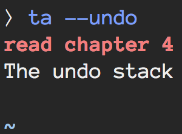
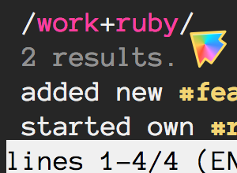
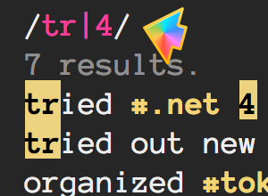
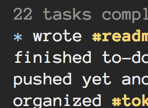
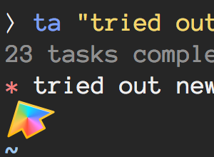
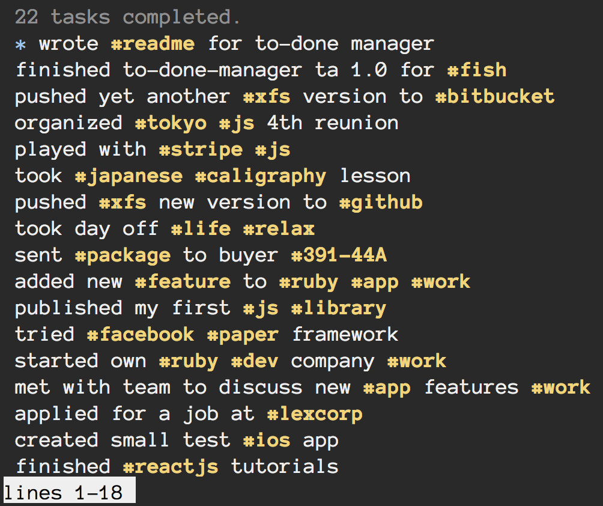

<a name="ta"></a><em>
<p align="center">
:ledger: <b>ta</b>
|
<b><a href="#features">Features</a></b>
|
<b><a href="#rationale">Rationale</a></b>
|
<b><a href="#install">Install</a></b>
|
<b><a href="#synopsis">Synopsis</a></b>
|
<b><a href="#issues">Issues</a></b>
|
<b><a href="#about">?</a></b>
</p>

<p align="center">

</p>


___ta___ is a CLI-based _to-done_ task manager. The advantage over _to-do_ lists are:

1. You __don't__ change your routine or habits.

2. You __don't__ need to follow a predictable workflow.

3. You focus on completing stuff first. Log. Repeat.

4. Tasks are [inmutable](#undoing-tasks). Like time travel.

See [rationale](#rationale) for a more lengthy discussion.

## <a name="features">Features</a>

<p align="center">
<table>
    <tr>
      <tr>
        <th>1. <a href="#adding-tasks">Adding Tasks</a></th>
        <th>2. <a href="#undoing-tasks">Undoing Tasks</a></th>
        <th>3. <a href="#searching-tasks">Searching Tasks</a></th>
      </tr>
      <tr>
        <td></td>
        <td></td>
        <td></td>
      </tr>
    </tr>
    <tr>
      <th>4. <a href="#searching-tasks">Regex</a></th>
      <th>5. <a href="#navigating-tasks">Navigating Tasks</a></th>
      <th>6. <a href="#recent-tasks">Recent Task Marker</a></th>
      <tr>
        <td></td>
        <td></td>
        <td></td>  
      </tr>
    </tr>
</table>

<p align="right">
<a href="#ta">:arrow_up:</a> <a href="#ta">Top</a></p>
</p>

<hr>


### <a name="adding-tasks">Adding Tasks</a>

  * `ta "called #mom"`
  * `ta "pushed ta to #gh #projects"`

### <a name="undoing-tasks">Undoing Tasks</a>

Tasks in _ta_ are, by definition, inmutable. It's like time travel. You are not allowed.

It _is_ possible, however, to undo _only_ the most recent task:

  * `ta -u` or `ta --undo`

> __Note__: _ta_ is a productivity tool to help you improve your workflow, but it's not a task scheduler. If you are looking for a traditional _to-do_ manager I recommend looking at [Swatto/td](https://github.com/Swatto/td).

### <a name="searching-tasks">Searching Tasks</a>

Use `-s --search <tag>` to search for tasks tagged by `<tag>`.

  * `ta -s spanish+jul`

  List _#spanish_ tasks in July.

  * `ta -s work+opensource`

  List _#work_ __and__ _#opensource_ tasks.

  * `ta --search family+friends -n5`

  List _#family_ __and__ _#friends_ tasks. _5 max._

Use `--regex -s <query>` or `-rs <query>` to search by an arbitrary regular expression.

  * `ta -rs "workout|cardio|gym"`

  List __all__ _#workout_, _#cardio_ __or__ _#gym_ tasks

### <a name="navigating-tasks">Navigating Tasks</a>

Simply type `ta` to display all tasks. The task at the top is the most recent one.

The list dump is piped into [`less`](http://linux.die.net/man/1/less) so you can easily navigate up and down, run inline searches, etc.

[See here](http://bit.ly/17qd1KM) for a full list of options.

<p align="center">

</p>

You can also limit the number of tasks using the `-n --number <number>` option.

### <a name="recent-tasks">Recent Tasks</a>

If you complete any task within ten minutes of the previously added task, the `*` marker will turn red. It's up to you to interpret that as either a good or a bad sign.

<p align="right">
<a href="#ta">:arrow_up:</a> <a href="#ta">Top</a></p>

## <a name="rationale">Rationale</a>

  In a todo-like system, each task is a promise scheduled to be fulfilled
  in the future. In practice, promises can be hard to keep and prioritize.

  GTD-like methods offer good strategies to help with this, but they often
  require breaking die-to-hard habits and can be too complicated for users.

  Information flux is unpredictable, and dividing how this information is
  collected and processed in often overlapping stages is challenging.

  A to-done approach is not incompatible with traditional todo-lists, but
  it was created in a world where todo lists are not prominent.

  The premise is, as information flow crosses over the singularity threshold,
  data-collection and sorting becomes impossible and unwieldy. The contract
  is to spend _less_ time prioritizing and concentrate in completing only _one_
  task at a time. Only completed tasks can be logged into the system.

  Overall happiness and motivation increase will be directly proportional
  to the number of completed tasks.

<p align="right">
<a href="#ta">:arrow_up:</a> <a href="#ta">Top</a></p>

## <a name="install">Install</a>

### Fish

#### _Oh-my-fish_
Add the `ta` plugin to `$fish_plugins` via `~/.config/fish` or from your prompt:
```fish
set -g fish_plugins $fish_plugins ta
```

#### _Standalone_

Trust me and run:
```fish
curl -L http://git.io/install-ta | fish
ta "just installed #ta #right-move"
```
or if you are so inclined have a look at [`tools/install`](tools/install)

You can also specify the installation path:

```fish
curl -L http://git.io/install-ta | env INSTALL_PATH="to/your/path/" fish
ta "just installed #ta #right-move"
```

#### <a name="uninstall"></a> Uninstall

```fish
fish $ta_path/tools/uninstall
```

<p align="right">
<a href="#ta">:arrow_up:</a> <a href="#ta">Top</a></p>

## <a name="synopsis">Synopsis</a>

```
ta [<task #tag1 #tag2...">]
   [-u --undo]
   [-s --search <key[+key...]>]
   [-r --regex]
   [-n --number <number>]
   [-h --help]
   [--version]
```

### ta _task_

Add a completed task. Append a :hash: to keywords to apply tags.

Simply run `ta` without arguments to list all completed tasks.

### -s --search _key_[, ...]
Search tasks tagged by _key_.

Use `+` to search tasks with all the specified tags.

Use the `-r` option and concatenate keys with `|` to search for all tasks with any of the specified tags.

#### Special Tags

The following tags are never displayed in results, but available to use in search queries:

* Weekdays: `mon...sun`
* Month: `jan...dec`
* Day: `1st, 2nd, 3rd, 4th...31st`
* Time: `12am...12pm`

> __Note__: These tags are added automatically to each task depending on the current time and date.

### -r --regex
Use together with `-s` and evaluate _key_ as a regular expression.

### -n --number _N_

Truncate number of results to _N_.

### -u --undo

Delete most recent task.

> __Note__: Using this option locks the ability to undo until a new task is committed protecting users from engaging in useless housekeeping habits.

### -h --help

Show usage help.

### --version

Show version information and trivia info.

<p align="right">
<a href="#ta">:arrow_up:</a> <a href="#ta">Top</a></p>

## <a name="issues">Issues</a>

I welcome your [feedback, comments, opinions, bug reports](https://github.com/bucaran/ta/issues) and/or [PR](https://github.com/bucaran/ta/issues)s. Thanks.


## <a name="about">About</a>

  If you are curious, ___ta___ or rather __た__, is a conjugation / deflection used in
  Japanese to indicate the completion of an action ([perfective aspect](http://en.wikipedia.org/wiki/Perfective_aspect)), roughly corresponding
  to the past tense in western languages.

<p align="right">
<a href="#ta">:arrow_up:</a> <a href="#ta">Top</a></p>

## <a name="license">License</a>

[MIT](http://opensource.org/licenses/MIT) :heart: [Jorge Bucaran](https://github.com/bucaran)
