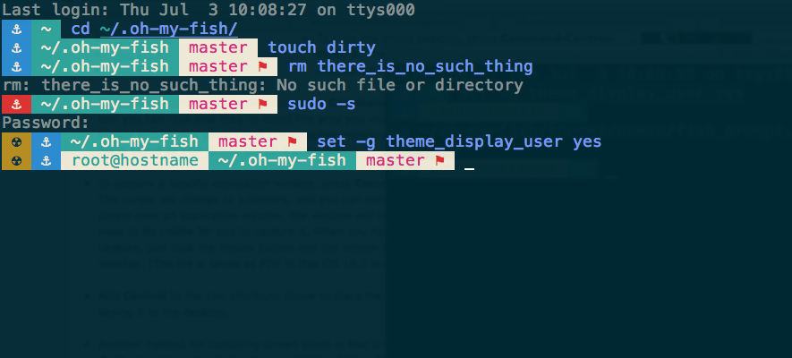

## ocean

A fish theme with ocean in mind.





Unicode-compatible fonts and terminals is required.
I would recommend iTerm2 + Solarized Dark for Mac users.
This theme is based loosely on [agnoster](https://gist.github.com/agnoster/3712874)

#### Characteristics
* Show a radioactive symbol when gain the root privileges (It's dangerous!)
* Current python virtualenv (if applicable)
* The anchor turn red if the previous command failed
* Full path of current working directory
* Git branch and dirty state (if applicable)
* Show User @ Hostname if user is not default\_user
    to turn on this feature, set these two lines in your config.fish
    ```
    set -g theme display_user yes

    set -g default_user your_default_username
    ```
